# Social Robot AR

This repo is the AR social functions of L33tKidz's launch product. It is based on AR Foundation and AzureSpatialAnchor. It aims to build a multi-platform AR shared experience including ARCore (Android), ARKit (IOS), and WMR (HoloLens). Currently, it is tested on ARCore platform only.

## Requirements

* Two developer enabled and ARCore capable Android devices
* Unity 2019.1.14f1 including the Android Build Support and Android SDK 9.+(Q) & NDK Tools modules
* Git

## How to Set up this project

1. Set up your Azure Spatial Anchor Account.  
Follow the [Azure Spatial Anchor Tutorial](https://docs.microsoft.com/en-us/azure/spatial-anchors/quickstarts/get-started-unity-android), do the following 2 steps.  
    1. Create an Azure account.  
    2. Create a `Spatial Anchors` resource.  
    Store the `Account ID` and `Primary Key` into some places. In this project, the  
        * `Account ID` 6616fce2-1b28-4fed-8ba9-c0bfb5acb35b
        * `Primary Key` AWFhKCI/4SBNs+M9ZrHuuD3KT+9bxoLDTJZmokyRxPM=
2. Set up your Sharing Anchors Service and Plan.  
Follow the [Tutorial: Share Azure Spatial Anchors across sessions and devices](https://docs.microsoft.com/en-us/azure/spatial-anchors/tutorials/tutorial-share-anchors-across-devices) to do the following 3 steps.
    1. Download the Unity sample project
    2. Deploy your Sharing Anchors Service
    3. After you publish your ASP.NET web app, copy the the URL of the web page. In this project, it is
        * `https://sharingserviceforsocialar.azurewebsites.net`
3. [Optional] Set up Azure Cosmos DB to store Anchors permanently.  
If you want to store your anchors into CosmosDB other than InMemory, follow the [Tutorial: Share Azure Spatial Anchors across sessions and devices with an Azure Cosmos DB back end] to do the following steps.
    1. Create a database account.
    2. Deploy the sharing anchors service.
    3. After you publish your ASP.NET web app, copy the the URL of the web page.
4. Configure this project.
    1. Download or clone this project, use Unity to open this project, from `Window - Package Manger`, install the following packages if needed
        * `AR Foundation`
        * `AR Core XR Plugin`
        * `AR Kit XR Plugin`
        * `Windows Mixed Reality`
        * `Multiplayer HLAPI`
        * `XR Legacy Input Helpers`
    2. In the project, navigate to `Assets\AzureSpatialAnchors.SDK\Resources\SpatialAnchorConfig`, in the inspector, paste your `Azure Account ID` and `Primary Key` created in step 1 to corresponding positions
    
    3. Open `Assets\Scenes\main`, in the Hierarchy, select `AzureSpatialAnchors`. In the Inspector, paste the URL of the web page got from step 2 or step 3 to the `Base Sharing URL`  
    
5. Build and Deploy.
    1. Open `File - Build Settings`
    2. Under Scenes in build, make sure the first one is `Scenes/RobotSelection` and the second one is `Scenes/main`
    3. In the platform, click `Android`, then click `Switch Platform`
    4. Connect your phone to PC via USB. Make sure you open the `Developer Mode` in your phone and allowing `USB Debugging`
    5. Click `Build And Run` in Unity, the project will be built and deployed automatically to your phone. The total build settings should be as follows.
    

## How to Play

### Robot Selection and Mode Selection

1. Make sure your two phones connected the same WiFi
2. When you deploy the apk to your phone, an App called `SocialRobot` on your phone. It looks like as follows

3. Open the App, now you are in a robot selection page, you can switch the robot that you want to use in the following game play. There are also three buttons in the bottom-left corner, which provide you our 3 modes to play: `PVP`, `PVP AR`, `PVE`.
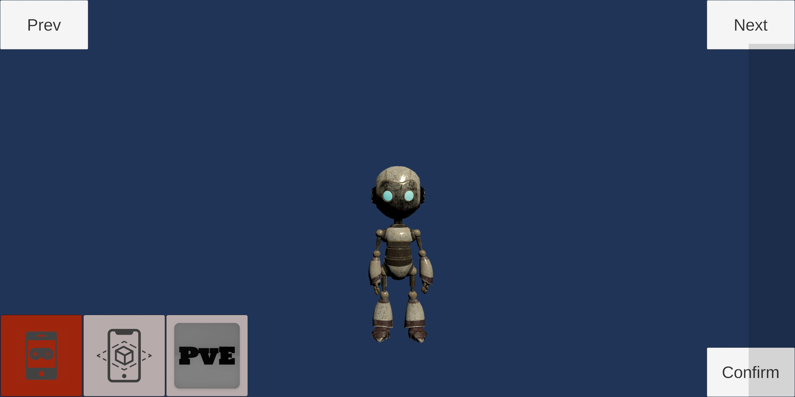

### PVP Mode

1. select your favorite robot and the `PVP` mode in the robot selection page, and then click `Confirm`, you can join a factory map.
2. By clicking the `NoRoom` button, you can open the room manager.
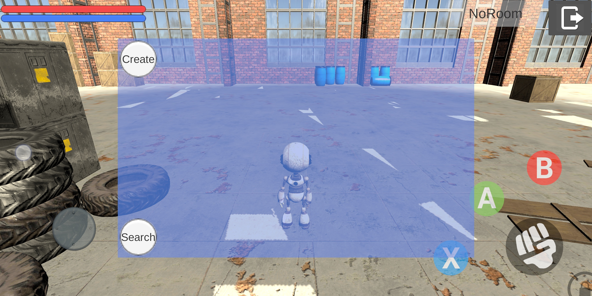
3. In the **first phone**, tap `Create`, then you will create a room in the server, and the room name will appear in the button.
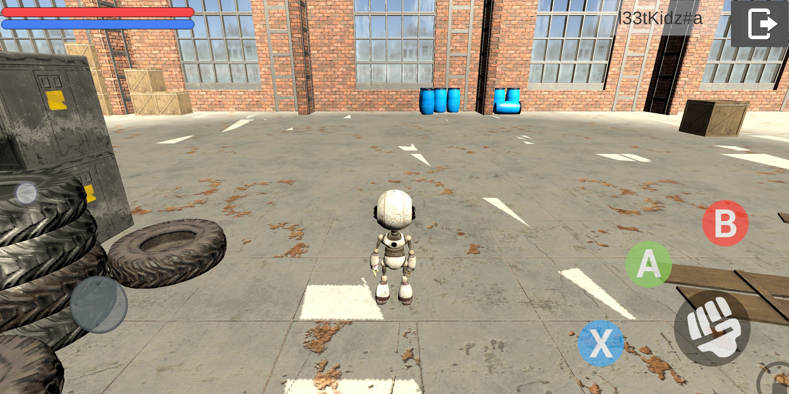
4. In the **second phone**, tap `Check`, the existing rooms in the server will appear.

5. Touch `Join` to join the room that the first phone created. Now, the two robot can fight with each other.
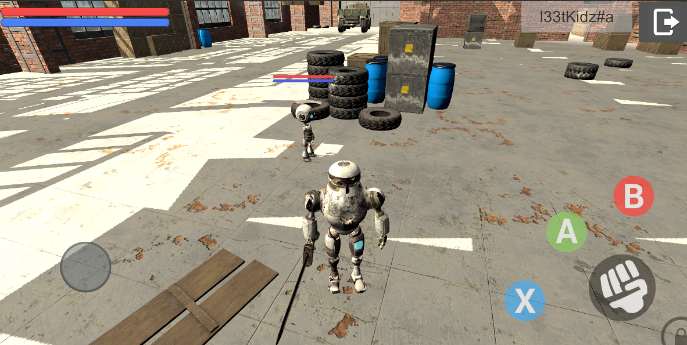
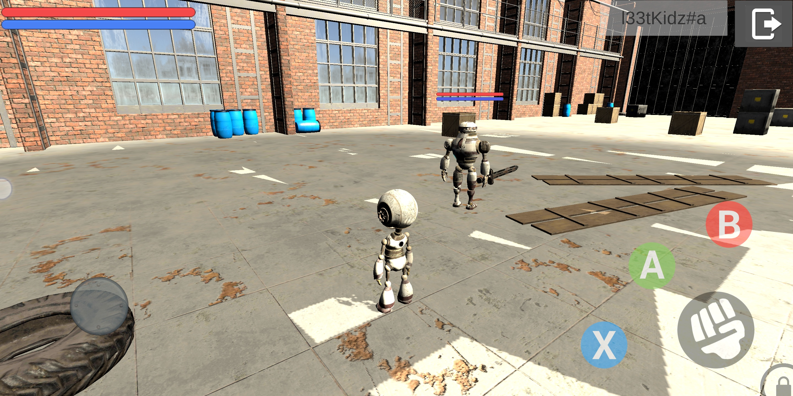
6. More information of fight will include in the following part.

### PVP AR Mode

1. In the robot selection page, select a robot and the `PVP AR` mode to join the AR scene. Now you can see your environment through the camera.
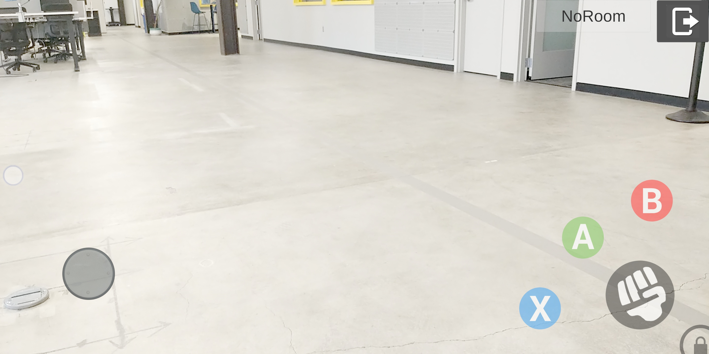
2. Similar to the `PVP` mode, open the room manager and create a room in the first phone.
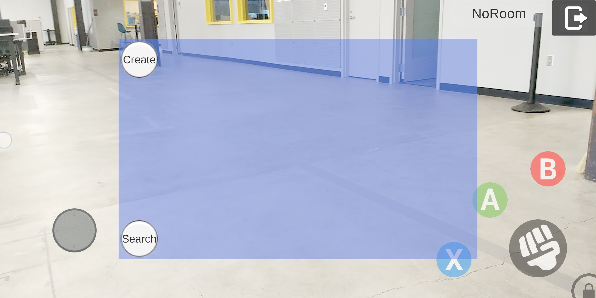
3. Tap the red plane to place an anchor and then you need to move your phone to scan the environment
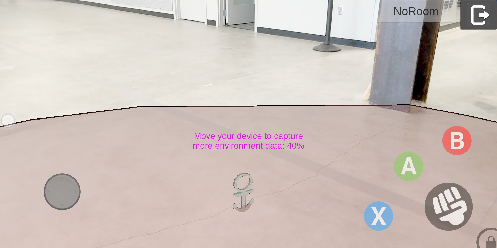
4. After scan the environment, tap the red plane again to place your robot in real environment.

5. Join this room in the similar way of `PVP` mode in the second phone.

### PVE Mode

1. In the robot selection page, select a robot and the `PVE` mode to join a factory map.
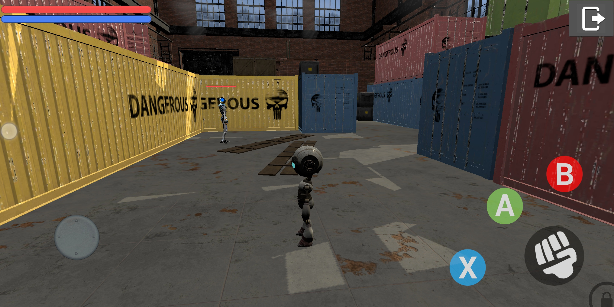
2. In the factory map, you can walk around and pick up materials, which is your resources to build more robot in your factory.

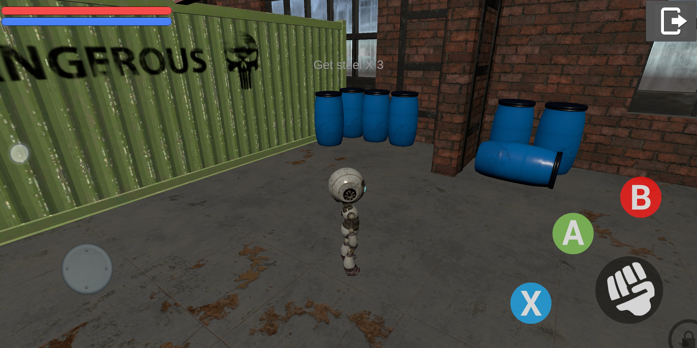
3. There are also several AI enemies in the map which patrol in specific areas but they will chase and attack you when they find you.
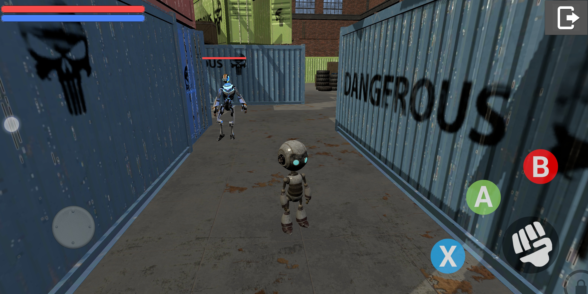

### Fighting Details

- Whatever mode and robot you choose, the fighting control is the same. We provide several button and corresponding actions.

| Button | Action | Harm | Consume MP | Cause Other Still | Other info |
|:-----  |:----- |:----- |:----- |:-----|:----- |
| Button 'Fist' | Single attack | 1 HP | 0 MP | No | By clicking several times to make multi-segment attack |
| Button A | Skill 1 | 10 HP | 20 MP | No | Multi-segment attack, faster than normal attack |
| Button B | Skill 2 | 20 HP | 40 MP | Yes | Multi-segment attack, AOE |
| Button X | Jump | | | | Different when stand jump and run jump |

- Users can also use the joystick to control the movement of the robot. Users can also touch the screen to adjust the camera view.
- There is a HP bar (red) and MP bar (blue) showing robots' status. Player's HP and MP bar is in the top-left, others' including other players and enemies are in the top of their head.
- By touching other players or enemies, you can open the `Attack Correction`. In this mode, there will be a red arrow in the top of the head of other robots, all the direction of attack actions will be corrected to the direction towards the robot.

By clicking the `Lock` icon, you can unlock the `Attack Correction`. The red arrow disappears and your attack direction in the forward of your player.
